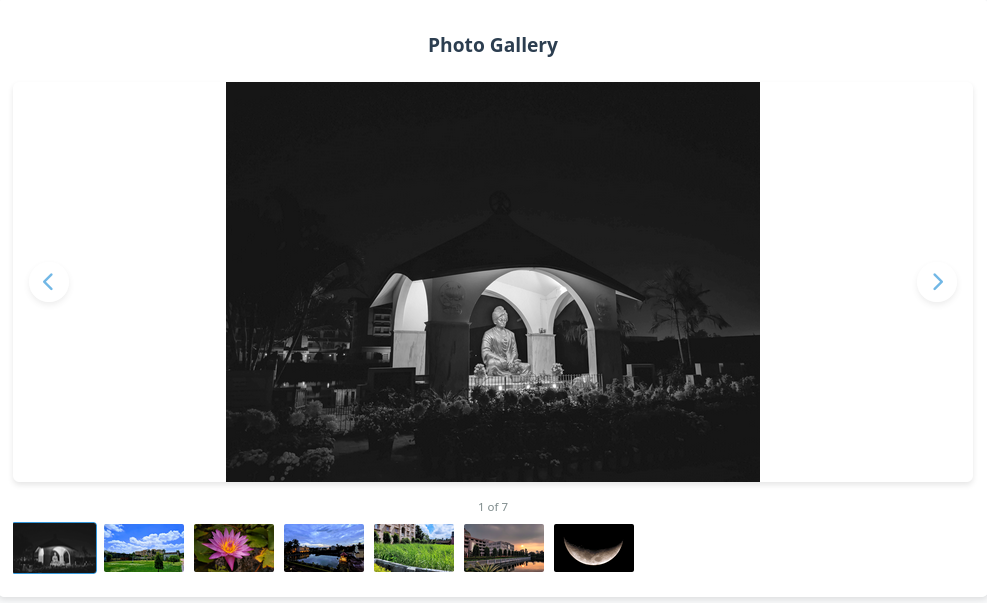

# Image Gallery

A modern, responsive image gallery with auto-play functionality.

 

## Features

- 🖼️ Responsive image display
- ⏭️ Auto-advancing slideshow (5s interval)
- ⏯️ Play/pause controls
- ↔️ Navigation arrows and keyboard support (← →)
- 📱 Mobile-friendly design
- 🌓 Dark/light mode friendly

## How to Use

1. Clone the repository:

   ```bash
   git clone https://github.com/shirshak007/simpleImageSliderJsCss.git
   ```

2. Open `index.html` in your browser

## Customization

Edit `data.json` to add your own images:

```json
{
  "images": [
    {"src": "path/to/your-image1.jpg"},
    {"src": "path/to/your-image2.jpg"}
  ]
}
```

## Demo

[Live Demo](https://shirshak007.github.io/simpleImageSliderJsCss/)

## License

MIT © [Your Name](https://github.com/shirshak007)
